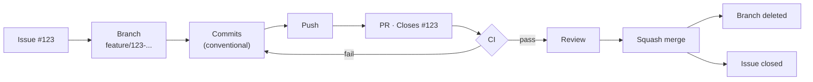

# ai

### Your core stack

| Tool | Responsibility |
|---|---|
| **Git** | Source control, branches, commits, worktrees, merge/rebase |
| **VS Code** | Editor + native Git/worktree UI |
| **GitHub** | Issues, PRs, Actions, repository |
| **`gh`** | GitHub CLI: issues, PRs, Actions |
| **`npx` + Skills** | AI workflows/instructions |
| **Claude Code** | AI agent |

### I'd add these

| Tool | Responsibility | Priority |
|---|---|---:|
| **GitHub Actions** | Automated tests/build/lint on PRs | ⭐⭐⭐⭐⭐ |
| **Git hooks** | Enforce rules locally | ⭐⭐⭐⭐ |
| **`mise`** | Pin/manage project tool versions | ⭐⭐⭐⭐ |
| **Dev Containers** | Reproducible development environment | ⭐⭐⭐ |
| **GitHub Projects** | Organize Issues/tasks | ⭐⭐⭐ |
| **Dependabot** | Dependency update PRs | ⭐⭐⭐ |
| **`direnv`** | Per-project environment variables | ⭐⭐ |
| **pre-commit** | Run validation before commits | ⭐⭐ |

### Workflow



### Git / `gh` config useful for AI workflows

```bash
git config extensions.worktreeConfig true
git config --global push.autoSetupRemote true
gh config set prompt disabled
```

### GitHub repository settings

Protect `main`:

```
main
├── Require pull request
├── Require CI checks
├── Require conversation resolution
├── Block force pushes
├── Block branch deletion
└── Require branch to be up to date (optional)
```

Also enable **automatically delete head branches** after merge.

> Nothing goes directly into main.

### Branch naming

```
feature/123-add-auth
fix/124-token-expiration
refactor/125-auth-service
docs/126-update-readme
chore/127-update-deps
```

Issue #123 → branch → commits → PR → `Closes #123`

### Issue templates

YAML forms, not markdown — structured fields parse reliably for AI/automation.

```
.github/
└── ISSUE_TEMPLATE/
    ├── feature.yml
    ├── bug.yml
    ├── task.yml
    └── config.yml   # blank_issues_enabled: false
```

### GitHub issue labels

```
bug
feature
refactor
docs
chore
```

Plus:

```
p0 / p1 / p2   # priority
agent          # AI-authored, for later auditing
```

```
.github/
└── labels.yml
```

### Pull request template

```
.github/
└── PULL_REQUEST_TEMPLATE.md
```

### GitHub Actions

```
.github/
└── workflows/
    ├── ci.yml
    └── ...
```

Minimum:

```
CI
├── install
├── lint
├── typecheck
├── test
└── build
```

### Git hooks

Use hooks for things that should be enforced locally.

```
.git/
└── hooks/
    └── commit-msg
```

Enforce:

```
feat: ...
fix: ...
refactor: ...
test: ...
docs: ...
chore: ...
```

### `.editorconfig`

Consistent formatting across VS Code and other editors.

```ini
root = true

[*]
charset = utf-8
end_of_line = lf
insert_final_newline = true
indent_style = space
indent_size = 2

[*.md]
trim_trailing_whitespace = false
```

### VS Code configuration

Commit project-level config:

```
.vscode/
├── settings.json
├── extensions.json
└── tasks.json
```

`extensions.json` recommends extensions for the project:

```json
{
  "recommendations": [
    "EditorConfig.EditorConfig",
    "redhat.vscode-yaml",
    "eamodio.gitlens",
    "GitHub.vscode-pull-request-github",
    "humao.rest-client"
  ]
}
```

Don't force extensions unless absolutely necessary.

### VS Code extensions

- **GitLens** — inline blame/history, fastest way to see what an agent changed and when without leaving the editor.

### GitHub Dependabot

```
.github/
└── dependabot.yml
```

GitHub automatically creates dependency PRs.

### `AGENTS.md`

At the repository root. Keep it short — Skills hold the detailed workflows.

```markdown
# Development Instructions

## Git
- Work only in the current worktree.
- Never work directly on `main`.
- Inspect `git status` before making changes.
- Use Conventional Commits.

## GitHub
- Every task should correspond to a GitHub Issue.
- Reference the Issue in the PR (`Closes #123`).
- Do not merge PRs unless explicitly requested.

## Testing
- Run relevant tests before committing.
- Run the build before creating a PR.

## Code
- Follow existing project architecture.
- Don't modify unrelated files.
```

### `.gitignore`

Prevents build output, `node_modules`, and `.env` from ever being committed — the base guard against an agent leaking secrets or bloating history.

```gitignore
node_modules/
dist/
build/
.env
.env.*
!.env.example
```

### `.npmrc`

Pins install behavior so an agent gets identical results across sessions/worktrees, not whatever the resolver feels like that day.

```ini
engine-strict=true
save-exact=true
```

### `docs/`

Start flat. Split into subfolders only once one category has enough files to justify it.

```
docs/
├── api/            # endpoint docs, .http files, openapi.yaml
├── architecture/   # design decisions, diagrams
├── guides/         # how-to / setup / onboarding
└── assets/         # images used by the docs above
```

### Your final repository structure

```
.
├── .github/
│   ├── ISSUE_TEMPLATE/
│   │   ├── feature.yml
│   │   ├── bug.yml
│   │   ├── task.yml
│   │   └── config.yml
│   ├── workflows/
│   │   └── ci.yml
│   ├── PULL_REQUEST_TEMPLATE.md
│   ├── dependabot.yml
│   └── labels.yml
├── .vscode/
│   ├── settings.json
│   ├── extensions.json
│   └── tasks.json
├── docs/
│   ├── api/
│   ├── architecture/
│   ├── guides/
│   └── assets/
├── .editorconfig
├── .gitignore
├── .npmrc
├── AGENTS.md
└── README.md
```
