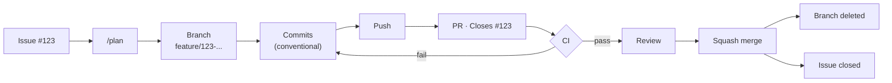

## Setup checklist

Tick these off in order. Details for each are in the matching section below.

**Do first — nothing else works well without these**

- [ ] `gh` CLI installed and authenticated — needed to script the GitHub-side steps below
- [ ] [Canonical `check` / `fix` / `verify` commands](#canonical-commands)
- [ ] [`AGENTS.md`](#agentsmd) at repo root — Commands + Safety sections — nest more in subfolders as they need their own rules
- [ ] [`.gitignore`](#gitignore) — block `node_modules/`, `dist/`, `.env`
- [ ] [CI workflow](#github-actions-ci) — install → check → build
- [ ] [Branch protection on `main`](#repository-settings) — require PR + passing CI, block force-push
- [ ] [Secret scanning + push protection](#repository-settings) enabled (Settings → Code security)

**Do next — makes the agent noticeably better, not just safer**

- [ ] [`docs/INDEX.md`](#docs) + [`docs/architecture/overview.md`](#docs)
- [ ] [Git hook runner](#git-hooks) (pre-commit) enforcing Conventional Commits
- [ ] [`.editorconfig`](#editorconfig)
- [ ] [Issue templates](#issue-templates) (YAML forms)
- [ ] [PR template](#pull-request-template)
- [ ] [Labels](#labels) (`bug`/`feature`/`refactor`/`docs`/`chore` + `p0`–`p2` + `agent`)
- [ ] [Dependabot](#dependabot)
- [ ] [`.npmrc`](#npmrc) (`engine-strict`, `save-exact`)
- [ ] [`.env.example`](#envexample) kept in sync with `.env`
- [ ] `mise` pinning the toolchain (`.mise.toml`) — reproducibility, not a team-size feature
- [ ] [`docs/testing.md`](#docs) — what kind of test belongs where, and "don't weaken tests to pass"
- [ ] `rg` and `jq`/`yq` installed locally

**Later — once it's not just you**

- [ ] [CODEOWNERS](#codeowners)
- [ ] Dev Containers
- [ ] GitHub Projects
- [ ] `direnv`
- [ ] ADRs under `docs/architecture/decisions/`

## Reference

Everything above, explained.

- [Stack](#stack)
- [Workflow](#workflow)
- [GitHub configuration](#github-configuration)
- [Local tooling](#local-tooling)
- [Files that help the agent specifically](#files-that-help-the-agent-specifically)
- [CLI tools](#cli-tools)
- [Final repository structure](#final-repository-structure)

## Stack

### Core

| Tool | Responsibility |
|---|---|
| **Git** | Source control, branches, commits, worktrees, merge/rebase |
| **VS Code** | Editor + native Git/worktree UI |
| **GitHub** | Issues, PRs, Actions, repository |
| **`gh`** | GitHub CLI: issues, PRs, Actions |
| **`npx` + Skills** | AI workflows/instructions |
| **Claude Code** | AI agent |

### Worth adding — no dedicated section below

| Tool | Responsibility | Priority |
|---|---|---:|
| **`mise`** | Pin/manage project tool versions | ⭐⭐⭐⭐ |
| **Dev Containers** | Reproducible development environment | ⭐⭐⭐ |
| **GitHub Projects** | Organize Issues/tasks | ⭐⭐⭐ |
| **`direnv`** | Per-project environment variables | ⭐⭐ |

## Workflow



**Worktrees** — sequential for one thing at a time, parallel for independent issues:

```text
Sequential   issue → done → issue → done
Parallel     issue-a ▸ worktree-a  ┐
             issue-b ▸ worktree-b  ├─ same time
             issue-c ▸ worktree-c  ┘
```

**Git / `gh` config:**

```bash
git config extensions.worktreeConfig true
git config --global push.autoSetupRemote true
gh config set prompt disabled
```

## GitHub configuration

### Repository settings

Protect `main`:

```text
main
├── Require pull request
├── Require CI checks
├── Require conversation resolution
├── Block force pushes
├── Block branch deletion
└── Require branch to be up to date (optional)
```

Also enable **automatically delete head branches** after merge, and **secret scanning + push protection** (Settings → Code security) — free, GitHub-native, zero config, the cheapest defense against an agent leaking a key.

> Nothing goes directly into main.

### Branch naming

```text
feature/123-add-auth
fix/124-token-expiration
refactor/125-auth-service
docs/126-update-readme
chore/127-update-deps
```

Issue #123 → branch → commits → PR → `Closes #123`

### Issue templates

YAML forms, not markdown — structured fields parse reliably for AI/automation.

```text
.github/
└── ISSUE_TEMPLATE/
    ├── feature.yml
    ├── bug.yml
    ├── task.yml
    └── config.yml   # blank_issues_enabled: false
```

### Labels

```text
bug
feature
refactor
docs
chore
```

```text
.github/
└── labels.yml
```

### Pull request template

```text
.github/
└── PULL_REQUEST_TEMPLATE.md
```

### GitHub Actions (CI)

```text
.github/
└── workflows/
    └── ci.yml
```

Minimum:

```text
CI
├── install   (cached — keeps the agent's feedback loop fast)
├── check     (same command as local — see Canonical commands)
└── build
```

Run the exact same `check`/`verify` command here as locally, not a parallel set of steps that happens to check similar things — see [Canonical commands](#canonical-commands). CI existing to catch a difference between "passes locally" and "passes for real" only works if there isn't a second, slightly different definition of "passes."

### Dependabot

```text
.github/
└── dependabot.yml
```

GitHub automatically creates dependency PRs.

### CODEOWNERS

```text
.github/
└── CODEOWNERS
```

Explicit review boundaries once more than one contributor — human or agent — is involved. Skip it for a solo repo; there's no one to route to.

## Local tooling

### Git hooks

`.git/hooks/` isn't tracked by git, so it won't survive a clone or new worktree. Use **pre-commit** instead — its config (`.pre-commit-config.yaml`) is a committed file, so every worktree gets the same hooks.

Enforce, at minimum, Conventional Commits on `commit-msg`:

```text
feat: ...
fix: ...
refactor: ...
test: ...
docs: ...
chore: ...
```

### `.editorconfig`

Consistent formatting across VS Code and other editors.

```ini
root = true

[*]
charset = utf-8
end_of_line = lf
insert_final_newline = true
indent_style = space
indent_size = 2

[*.md]
trim_trailing_whitespace = false
```

### Prettier

`.editorconfig` sets baseline editor behavior; it doesn't rewrite code. Prettier auto-fixes style, so output is formatted consistently every time.

```json
{
  "scripts": {
    "format": "prettier --write ."
  }
}
```

- Wired into `check` via `format:check` (see [Canonical commands](#canonical-commands)); add it as a `pre-commit` hook too if you want the fix applied before the commit even lands.
- Commit `.prettierrc` and `.prettierignore` so formatting is deterministic across sessions and worktrees, not whatever defaults happen to be installed.

### VS Code

Commit project-level config:

```text
.vscode/
├── settings.json
├── extensions.json
└── tasks.json
```

`extensions.json` recommends extensions for the project — don't force them unless necessary:

```json
{
  "recommendations": [
    "EditorConfig.EditorConfig",
    "eamodio.gitlens",
    "GitHub.vscode-pull-request-github"
  ]
}
```

**GitLens** is the one extension worth calling out specifically — inline blame/history, the fastest way to see what an agent changed and when without leaving the editor.

### `.gitignore`

Prevents build output, `node_modules`, and `.env` from ever being committed — the base guard against an agent leaking secrets or bloating history.

```gitignore
node_modules/
dist/
build/
.env
.env.*
!.env.example
```

### `.npmrc`

Pins install behavior so an agent gets identical results across sessions/worktrees, not whatever the resolver feels like that day.

```ini
engine-strict=true
save-exact=true
```

### `.env.example`

`.env` itself is gitignored, so without this the agent has no way to know what config even exists — it'll guess variable names or skip a feature that needs one. Commit the shape, not the values:

```bash
DATABASE_URL=
API_KEY=
PORT=3000
```

Keep it in sync with `.env` by hand — nothing enforces this automatically, so a stale `.env.example` quietly becomes as misleading as no file at all.

## Files that help the agent specifically

These are the highest-leverage additions in this document — the difference between "the agent read some rules" and "the agent's output is actually verified and placed correctly."

### Canonical commands

One command per action, runnable without guessing the package manager or flags:

```text
check   → format:check + lint + typecheck + test   (single entry point, run before every commit)
fix     → format + lint --fix                      (autofix what check would flag)
build   → production build
verify  → check + build                            ("is this actually ready" — run before opening a PR)
```

```json
{
  "scripts": {
    "format": "prettier --write .",
    "format:check": "prettier --check .",
    "lint": "eslint . --max-warnings 0",
    "fix": "npm run format && eslint . --fix",
    "typecheck": "...",
    "test": "...",
    "check": "npm run format:check && npm run lint && npm run typecheck && npm run test",
    "build": "...",
    "verify": "npm run check && npm run build"
  }
}
```

`git diff --check` is worth adding to `check` too — it's nearly free and catches whitespace/conflict-marker errors nothing else looks for.

Polyglot repo? Use `just` or a `Makefile` instead, so the entry point isn't tied to one language's tooling.

CI runs this same command — see [GitHub Actions (CI)](#github-actions-ci).

This is what gives the agent a deterministic pass/fail signal instead of a plausible-looking guess — the actual feedback loop, more than any instruction file. The `edit → check → fix failures → check` loop is simple enough that the agent doesn't need to understand your internal tooling at all — just that `verify` passing means done.

### `AGENTS.md`

At the repository root. Keep it short — Skills hold the detailed workflows.

```markdown
# Development Instructions

## Commands
- Install: `npm ci`
- Check: `npm run check`
- Fix: `npm run fix`
- Build: `npm run build`
- Verify: `npm run verify`
See `docs/INDEX.md` before searching the codebase blind.

## Git
- Work only in the current worktree.
- Never work directly on `main`.
- Inspect `git status` before making changes — including before reset, checkout, clean, or stash.
- Use Conventional Commits.

## GitHub
- Every task should correspond to a GitHub Issue.
- Reference the Issue in the PR (`Closes #123`).
- Do not merge PRs unless explicitly requested.

## Dependencies
- Never hand-edit the lockfile — update it only through package-manager commands.
- Commit lockfile changes alongside the `package.json` change that caused them.

## Testing
- Run `verify` before opening a PR.
- Every bug fix adds a regression test; every new feature adds tests.
- Do not weaken or delete a test to make it pass.

## Code
- Follow existing project architecture — see `docs/architecture/overview.md`.
- Don't modify unrelated files.

## Safety
- Never delete files unless the task requires it.
- Never read, modify, or commit secrets or `.env` files.
- Never disable a test or lint rule to make CI pass.
- Never `--force` push or rewrite history on a shared branch.
- Never modify CI or security configuration unless the task requires it.
- Ask before merging PRs, deleting branches, or making unrelated refactors.
```

The `Commands` block is the highest-leverage line in this file: it's the one thing that turns "the agent read the rules" into "the agent's output is verified," rather than trusting it to guess your package manager and flags correctly every session.

**Nest it.** Once the root file exists, add scoped `AGENTS.md` files inside the directories that need their own rules — the agent picks up the closest one to whatever it's editing, on top of the root:

```text
AGENTS.md
src/
├── AGENTS.md
└── api/
    └── AGENTS.md
tests/
└── AGENTS.md
docs/
└── AGENTS.md
```

### `docs/`

Start flat. Split into subfolders only once one category has enough files to justify it.

```text
docs/
├── INDEX.md        # map of everything below
├── testing.md      # what kind of test belongs where
├── api/            # endpoint docs, .http files, openapi.yaml
├── architecture/   # design decisions, diagrams
├── guides/         # how-to / setup / onboarding
└── assets/         # images used by the docs above
```

**`docs/INDEX.md`** — a one-page map so the agent finds things instead of grepping blind:

```markdown
# Docs Index
- [Architecture overview](architecture/overview.md)
- [Testing](testing.md)
- [API reference](api/)
- [Setup guide](guides/setup.md)
```

Update it whenever `docs/` changes — a stale index is worse than no index, since the agent will trust it.

**`docs/architecture/overview.md`** — module boundaries, where new code belongs, and why any unusual decisions exist. This is what lets an agent place a new file correctly instead of guessing from whatever's nearby. Once the project has enough of these, split them into ADRs under `docs/architecture/decisions/` — preserves *why*, not just *what*, so future agents don't re-litigate settled decisions.

**`docs/testing.md`** — what kind of test belongs where:

```text
Unit        → pure logic
Integration → modules interacting
E2E         → user workflows
```

Pair it with the Safety rule already in AGENTS.md: don't weaken or delete a test to make it pass. Without both together, an agent under pressure to get `check` green will take the shortcut of quietly gutting the assertion instead of fixing the bug.

## CLI tools

| Tool | Why it matters for AI coding | Priority |
|---|---|---:|
| **`gh`** | Agent checks CI/review status without leaving the CLI — `gh pr checks`, `gh run view`, `gh pr view --comments` | ⭐⭐⭐⭐⭐ |
| **`rg` (ripgrep)** | Fast, predictable search — what Claude Code's own search tool already shells out to | ⭐⭐⭐⭐⭐ |
| **`jq` / `yq`** | Inspect/transform JSON/YAML reliably instead of the agent guessing structure | ⭐⭐⭐⭐⭐ |

The one habit worth building in: an agent should reach for `gh` before asking you "did the PR pass?"

```bash
gh pr checks               # did CI pass
gh run view --log-failed   # why did it fail
gh pr view --comments      # what did review say
```

## Final repository structure

```text
.
├── .github/
│   ├── ISSUE_TEMPLATE/
│   │   ├── feature.yml
│   │   ├── bug.yml
│   │   ├── task.yml
│   │   └── config.yml
│   ├── workflows/
│   │   └── ci.yml
│   ├── PULL_REQUEST_TEMPLATE.md
│   ├── dependabot.yml
│   ├── labels.yml
│   └── CODEOWNERS
├── .vscode/
│   ├── settings.json
│   ├── extensions.json
│   └── tasks.json
├── docs/
│   ├── INDEX.md
│   ├── testing.md
│   ├── api/
│   ├── architecture/
│   │   ├── overview.md
│   │   └── decisions/
│   ├── guides/
│   └── assets/
├── .editorconfig
├── .gitignore
├── .npmrc
├── .env.example
├── .pre-commit-config.yaml
├── .prettierrc
├── .prettierignore
├── .mise.toml
├── AGENTS.md
└── README.md
```
