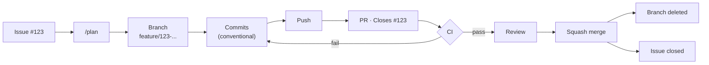

# ai

### 1. Your core stack

| Tool | Responsibility |
|---|---|
| **Git** | Source control, branches, commits, worktrees, merge/rebase |
| **VS Code** | Editor + native Git/worktree UI |
| **GitHub** | Issues, PRs, Actions, repository |
| **`gh`** | GitHub CLI: issues, PRs, Actions |
| **`npx` + Skills** | AI workflows/instructions |
| **Claude Code** | AI agent |

### 2. I'd add these

| Tool | Responsibility | Priority |
|---|---|---:|
| **GitHub Actions** | Automated tests/build/lint on PRs | ⭐⭐⭐⭐⭐ |
| **Git hooks** | Enforce rules locally | ⭐⭐⭐⭐ |
| **`mise`** | Pin/manage project tool versions | ⭐⭐⭐⭐ |
| **Dev Containers** | Reproducible development environment | ⭐⭐⭐ |
| **GitHub Projects** | Organize Issues/tasks | ⭐⭐⭐ |
| **Dependabot** | Dependency update PRs | ⭐⭐⭐ |
| **`direnv`** | Per-project environment variables | ⭐⭐ |
| **pre-commit** | Run validation before commits | ⭐⭐ |

### 3. Workflow



Worktrees — sequential for one thing at a time, parallel for independent issues:

```
Sequential   issue → done → issue → done
Parallel     issue-a ▸ worktree-a  ┐
             issue-b ▸ worktree-b  ├─ same time
             issue-c ▸ worktree-c  ┘
```

### 4. Git / `gh` config useful for AI workflows

```bash
git config extensions.worktreeConfig true
git config --global push.autoSetupRemote true
gh config set prompt disabled
```

### 5. GitHub repository settings

Protect `main`:

```
main
├── Require pull request
├── Require CI checks
├── Require conversation resolution
├── Block force pushes
├── Block branch deletion
└── Require branch to be up to date (optional)
```

Also enable **automatically delete head branches** after merge, and **secret scanning + push protection** (Settings → Code security) — free, GitHub-native, zero config, the cheapest defense against an agent leaking a key.

> Nothing goes directly into main.

### 6. Branch naming

```
feature/123-add-auth
fix/124-token-expiration
refactor/125-auth-service
docs/126-update-readme
chore/127-update-deps
```

Issue #123 → branch → commits → PR → `Closes #123`

### 7. Issue templates

YAML forms, not markdown — structured fields parse reliably for AI/automation.

```
.github/
└── ISSUE_TEMPLATE/
    ├── feature.yml
    ├── bug.yml
    ├── task.yml
    └── config.yml   # blank_issues_enabled: false
```

### 8. GitHub issue labels

```
bug
feature
refactor
docs
chore
```

Plus:

```
p0 / p1 / p2   # priority
agent          # AI-authored, for later auditing
```

```
.github/
└── labels.yml
```

### 9. Pull request template

```
.github/
└── PULL_REQUEST_TEMPLATE.md
```

### 10. GitHub Actions

```
.github/
└── workflows/
    ├── ci.yml
    └── ...
```

Minimum:

```
CI
├── install
├── lint
├── typecheck
├── test
└── build
```

### 11. Git hooks

Use hooks for things that should be enforced locally.

```
.git/
└── hooks/
    └── commit-msg
```

Enforce:

```
feat: ...
fix: ...
refactor: ...
test: ...
docs: ...
chore: ...
```

### 12. `.editorconfig`

Consistent formatting across VS Code and other editors.

```ini
root = true

[*]
charset = utf-8
end_of_line = lf
insert_final_newline = true
indent_style = space
indent_size = 2

[*.md]
trim_trailing_whitespace = false
```

### 13. VS Code configuration

Commit project-level config:

```
.vscode/
├── settings.json
├── extensions.json
└── tasks.json
```

`extensions.json` recommends extensions for the project:

```json
{
  "recommendations": [
    "EditorConfig.EditorConfig",
    "redhat.vscode-yaml",
    "eamodio.gitlens",
    "GitHub.vscode-pull-request-github",
    "humao.rest-client"
  ]
}
```

Don't force extensions unless absolutely necessary.

### 14. VS Code extensions

- **GitLens** — inline blame/history, fastest way to see what an agent changed and when without leaving the editor.

### 15. GitHub Dependabot

```
.github/
└── dependabot.yml
```

GitHub automatically creates dependency PRs.

### 16. `AGENTS.md`

At the repository root. Keep it short — Skills hold the detailed workflows.

```markdown
# Development Instructions

## Commands
- Install: `...`
- Check (lint + typecheck + test): `...`
- Build: `...`
See `docs/INDEX.md` before searching the codebase blind.

## Git
- Work only in the current worktree.
- Never work directly on `main`.
- Inspect `git status` before making changes.
- Use Conventional Commits.

## GitHub
- Every task should correspond to a GitHub Issue.
- Reference the Issue in the PR (`Closes #123`).
- Do not merge PRs unless explicitly requested.

## Testing
- Run `check` before committing.
- Run the build before creating a PR.

## Code
- Follow existing project architecture — see `docs/architecture/overview.md`.
- Don't modify unrelated files.
```

The `Commands` block is the highest-leverage line in this file: it's the one thing that turns "the agent read the rules" into "the agent's output is verified," rather than trusting it to guess your package manager and flags correctly every session.

### 17. `.gitignore`

Prevents build output, `node_modules`, and `.env` from ever being committed — the base guard against an agent leaking secrets or bloating history.

```gitignore
node_modules/
dist/
build/
.env
.env.*
!.env.example
```

### 18. `.npmrc`

Pins install behavior so an agent gets identical results across sessions/worktrees, not whatever the resolver feels like that day.

```ini
engine-strict=true
save-exact=true
```

### 19. `docs/`

Start flat. Split into subfolders only once one category has enough files to justify it.

```
docs/
├── api/            # endpoint docs, .http files, openapi.yaml
├── architecture/   # design decisions, diagrams
├── guides/         # how-to / setup / onboarding
└── assets/         # images used by the docs above
```

### 20. Canonical commands

One command per action, documented in AGENTS.md and runnable without guessing the package manager or flags:

```
check   → lint + typecheck + test   (single entry point, run before every commit)
test    → test suite
build   → production build
```

```json
{
  "scripts": {
    "check": "npm run lint && npm run typecheck && npm run test",
    "lint": "...",
    "typecheck": "...",
    "test": "...",
    "build": "..."
  }
}
```

Polyglot repo? Use `just` or a `Makefile` instead, so the entry point isn't tied to one language's tooling.

This is what gives the agent a deterministic pass/fail signal instead of a plausible-looking guess — the actual feedback loop, more than any instruction file.

### 21. `docs/INDEX.md`

A one-page map of `docs/`, so the agent finds things instead of grepping blind:

```markdown
# Docs Index
- [Architecture overview](architecture/overview.md)
- [API reference](api/)
- [Setup guide](guides/setup.md)
```

Update it whenever `docs/` changes — a stale index is worse than no index, since the agent will trust it.

### 22. Architecture overview

`docs/architecture/overview.md` — module boundaries, where new code belongs, and why any unusual decisions exist. This is what lets an agent place a new file correctly instead of guessing from whatever's nearby. Once the project has enough of these, split them into ADRs under `docs/architecture/decisions/`.

### 23. CLI tools you must have for AI coding

| Tool | Why it matters for AI coding | Priority |
|---|---|---:|
| **`gh`** | Agent checks CI/review status without leaving the CLI — `gh pr checks`, `gh run view`, `gh pr view --comments` | ⭐⭐⭐⭐⭐ |
| **`rg` (ripgrep)** | Fast, predictable search — what Claude Code's own search tool already shells out to | ⭐⭐⭐⭐⭐ |
| **`jq` / `yq`** | Inspect/transform JSON/YAML reliably instead of the agent guessing structure | ⭐⭐⭐⭐⭐ |
| **Lefthook *or* pre-commit** (pick one) | Automated local validation — don't run this alongside raw git hooks (§11), it's the same job twice | ⭐⭐⭐⭐ |
| **ADR system** (`docs/architecture/decisions/`) | Preserves *why*, not just *what* — future agents don't re-litigate settled decisions | ⭐⭐⭐⭐ |
| **CODEOWNERS** | Explicit review boundaries once more than one contributor — human or agent — is involved | ⭐⭐⭐ |

Skip: `tree`/`fd` (already covered by the agent's built-in file tools), `act` (adds a Docker dependency to replicate what a real CI run already tells you for free).

The one habit worth building in: an agent should reach for `gh` before asking you "did the PR pass?"

```bash
gh pr checks               # did CI pass
gh run view --log-failed   # why did it fail
gh pr view --comments      # what did review say
```

### 24. Your final repository structure

```
.
├── .github/
│   ├── ISSUE_TEMPLATE/
│   │   ├── feature.yml
│   │   ├── bug.yml
│   │   ├── task.yml
│   │   └── config.yml
│   ├── workflows/
│   │   └── ci.yml
│   ├── PULL_REQUEST_TEMPLATE.md
│   ├── dependabot.yml
│   ├── labels.yml
│   └── CODEOWNERS
├── .vscode/
│   ├── settings.json
│   ├── extensions.json
│   └── tasks.json
├── docs/
│   ├── INDEX.md
│   ├── api/
│   ├── architecture/
│   │   ├── overview.md
│   │   └── decisions/
│   ├── guides/
│   └── assets/
├── .editorconfig
├── .gitignore
├── .npmrc
├── AGENTS.md
└── README.md
```
