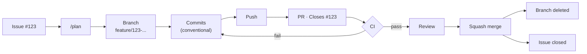

<div align="center">


# TypeScript Repo Template

Reusable, AI-agent-ready repo scaffold — Claude Code config, CI, release automation, and conventions wired up from day one.

</div>

## Setup checklist

**Do first — nothing else works well without these**

- [ ] `gh` CLI installed and authenticated
- [ ] [Canonical `check` / `fix` / `verify` commands](#canonical-commands)
- [ ] [`AGENTS.md`](#agentsmd) at repo root
- [ ] [`.gitignore`](#gitignore)
- [ ] [`.gitattributes`](#gitattributes)
- [ ] `LICENSE`
- [ ] [CI workflow](#github-actions-ci)
- [ ] [Repository settings](#repository-settings) — branch protection, merge strategy, secret scanning

**Do next — makes the agent noticeably better, not just safer**

- [ ] [`docs/`](#docs) — `api/`, `architecture/`, `guides/`
- [ ] [`.claude/`](#claude-directory)
- [ ] [Git hooks](#git-hooks)
- [ ] [`release-please`](#release-please)
- [ ] [`.editorconfig`](#editorconfig)
- [ ] [Issue templates](#issue-templates)
- [ ] [Pull request template](#pull-request-template)
- [ ] [PR title lint](#pr-title)
- [ ] [AI PR review](#ai-pr-review)
- [ ] [Labels](#labels)
- [ ] [Dependabot](#dependabot) + [Code scanning](#code-scanning)
- [ ] [`.npmrc`](#npmrc)
- [ ] [`.env.example`](#envexample)
- [ ] `.mise.toml` + `.nvmrc`
- [ ] `rg` and `jq`/`yq` installed locally

**Later — once it's not just you**

- [ ] [`CODEOWNERS`](#codeowners)
- [ ] `CONTRIBUTING.md`
- [ ] Dev Containers
- [ ] GitHub Projects
- [ ] `direnv`
- [ ] ADRs under `docs/architecture/decisions/`

## Reference

Order: local machine → GitHub → agent-specific files → what happens per change. [Stack](#stack) and [CLI tools](#cli-tools) are lookup tables, not steps.

- [Local setup](#local-setup)
- [GitHub setup](#github-setup)
- [Files that help the agent specifically](#files-that-help-the-agent-specifically)
- [Shipping a change](#shipping-a-change)
- [Stack](#stack)
- [CLI tools](#cli-tools)
- [Final repository structure](#final-repository-structure)

## Local setup

### Canonical commands

```text
check   → format:check + lint + typecheck + test
fix     → format + lint --fix
build   → production build
verify  → check + build
```

```json
{
  "scripts": {
    "format": "prettier --write .",
    "format:check": "prettier --check .",
    "lint": "eslint . --max-warnings 0",
    "fix": "npm run format && eslint . --fix",
    "typecheck": "...",
    "test": "...",
    "check": "npm run format:check && npm run lint && npm run typecheck && npm run test && git diff --check",
    "build": "...",
    "verify": "npm run check && npm run build"
  }
}
```

- Polyglot repo → `just`/`Makefile` instead of npm scripts
- CI runs the identical `check`/`verify` command — see [GitHub Actions (CI)](#github-actions-ci)
- Agent loop: `edit → check → fix failures → check` — `verify` passing means done

### Git hooks

```text
.husky/
├── pre-commit    → npx lint-staged
└── commit-msg    → commitlint --edit
```

- Husky + lint-staged (JS/TS), wired via `npm install`/`prepare` script — non-JS repo → [`pre-commit`](https://pre-commit.com/) instead
- `commitlint.config.js` enforces Conventional Commits: `feat` `fix` `refactor` `test` `docs` `chore`

### `.editorconfig`

```ini
root = true

[*]
charset = utf-8
end_of_line = lf
insert_final_newline = true
indent_style = space
indent_size = 2

[*.md]
trim_trailing_whitespace = false
```

### Prettier + ESLint

```json
{
  "scripts": {
    "format": "prettier --write .",
    "lint": "eslint . --max-warnings 0",
    "fix": "npm run format && eslint . --fix"
  }
}
```

- Commit `.prettierrc` + `.prettierignore` — deterministic formatting across sessions/worktrees
- Add Prettier to `lint-staged.config.js` too if you want the fix applied before the commit lands, not just checked in CI
- `eslint.config.js` with `--max-warnings 0` — an agent left to itself will let warnings pile up otherwise

### VS Code

```text
.vscode/
├── settings.json     # defaultFormatter: esbenp.prettier-vscode, ESLint fixAll on save
├── extensions.json
├── tasks.json
└── launch.json
```

```json
{
  "recommendations": [
    "EditorConfig.EditorConfig",
    "eamodio.gitlens",
    "GitHub.vscode-pull-request-github",
    "dbaeumer.vscode-eslint",
    "esbenp.prettier-vscode"
  ]
}
```

Last two are required, not optional — `settings.json` depends on both being installed.

### `.gitignore`

```gitignore
node_modules/
dist/
build/
.env
.env.*
!.env.example
.DS_Store
Thumbs.db
desktop.ini
```

### `.gitattributes`

```gitattributes
* text=auto eol=lf
```

Forces LF at the Git level — `.editorconfig` alone doesn't stop CRLF checkout on `core.autocrlf=true` (default on Windows Git installs).

### `.npmrc`

```ini
engine-strict=true   # block installs on wrong node/npm version
save-exact=true      # pin new deps to X.Y.Z, not ^X.Y.Z
```

### `.env.example`

```bash
DATABASE_URL=
API_KEY=
PORT=3000
```

Commit the shape, not the values. Keep in sync with `.env` by hand.

### Worktrees & git config

```text
Sequential   issue → done → issue → done
Parallel     issue-a ▸ worktree-a  ┐
             issue-b ▸ worktree-b  ├─ same time
             issue-c ▸ worktree-c  ┘
```

```bash
git config extensions.worktreeConfig true
git config --global push.autoSetupRemote true
gh config set prompt disabled
```

## GitHub setup

### Repository settings

```text
Branches → main
├── Require pull request (0 approvals required)
├── Require status checks — ci, dependency-review, lint-pr-title
│     (list starts empty — add each check BY NAME, or it protects nothing)
├── Require conversation resolution
├── Block force pushes
└── Block branch deletion

General → Pull Requests
├── Squash merging: ON — "Default commit message" = Pull request title
│     (NOT the GitHub default — default silently uses the commit's own
│      message on any 1-commit PR, e.g. every Dependabot PR)
├── Merge commits: OFF
├── Rebase merging: OFF
└── Automatically delete head branches: ON

General
└── Description set — an empty one is the first sign of an abandoned repo

Code security
└── Secret scanning + push protection: ON
```

> Nothing goes directly into main.

### Labels

```bash
gh label create bug -c d73a4a -d "Something isn't working"
gh label create feature -c a2eeef -d "New functionality"
gh label create refactor -c fbca04 -d "Code change with no behavior change"
gh label create docs -c 0075ca -d "Documentation only"
gh label create chore -c cfd3d7 -d "Maintenance, tooling, deps"
```

```text
bug      → fix:
feature  → feat:
refactor → refactor:
docs     → docs:
chore    → chore:
```

Issue templates apply these automatically via each form's `labels:` field.

### Issue templates

```text
.github/
└── ISSUE_TEMPLATE/
    ├── feature_request.yml   # labels: [feature]
    ├── bug_report.yml        # labels: [bug]
    └── config.yml            # blank_issues_enabled: false
```

YAML forms, not markdown — structured fields parse reliably for AI/automation.

### Pull request template

```text
.github/
└── PULL_REQUEST_TEMPLATE.md
```

```markdown
## Summary
<!-- What does this PR do and why? -->
Closes #

## Changes
-

## Testing
- [ ] `npm run verify` passes
- [ ] Added/updated tests for the change
- [ ] Updated docs if behavior or setup changed
```

### `CODEOWNERS`

```text
.github/
└── CODEOWNERS
```

Solo repo → skip. Multiple contributors (human or agent) → add.

## Files that help the agent specifically

### `AGENTS.md`

```markdown
# Development Instructions

## Commands
- Install: `npm ci`
- Check: `npm run check`
- Fix: `npm run fix`
- Build: `npm run build`
- Verify: `npm run verify`

## Git
- Work only in the current worktree.
- Never work directly on `main`.
- Inspect `git status` before making changes — including before reset, checkout, clean, or stash.
- Use Conventional Commits.

## GitHub
- Every task should correspond to a GitHub Issue.
- Reference the Issue in the PR (`Closes #123`).
- Do not merge PRs unless explicitly requested.

## Dependencies
- Never hand-edit the lockfile — update it only through package-manager commands.
- Commit lockfile changes alongside the `package.json` change that caused them.

## Testing
- Run `verify` before opening a PR.
- Every bug fix adds a regression test; every new feature adds tests.
- Do not weaken or delete a test to make it pass.

## Code
- Follow existing project architecture — see `docs/architecture/overview.md`.
- Don't modify unrelated files.

## Safety
- Never delete files unless the task requires it.
- Never read, modify, or commit secrets or `.env` files.
- Never disable a test or lint rule to make CI pass.
- Never `--force` push or rewrite history on a shared branch.
- Never modify CI or security configuration unless the task requires it.
- Ask before merging PRs, deleting branches, or making unrelated refactors.
```

Nested, per directory that needs its own rules:

```text
AGENTS.md
src/
└── AGENTS.md
test/
└── AGENTS.md
```

### `docs/`

```text
docs/
├── api/
│   ├── overview.md
│   └── endpoints.md
├── architecture/
│   ├── overview.md          # module boundaries, where new code belongs
│   └── decisions/           # ADRs — 0001-title.md, one per decision
├── guides/
│   ├── getting-started.md
│   └── advanced-usage.md
└── assets/                  # images referenced by the docs above
```

### `.claude/` directory

```text
.claude/
├── CLAUDE.md        # what's in this folder and why
├── CONTRIBUTING.md  # how to add to each subfolder below
├── settings.json    # permissions, hooks, attribution — shared by everyone
├── commands/        # custom slash commands — /<filename>
├── agents/          # custom subagent definitions
├── skills/          # custom skills — folder + SKILL.md per skill
└── rules/           # rules scoped by file glob, not directory
```

`AGENTS.md` is the source of truth for instructions — this is tool-specific extension, not a duplicate.

## Shipping a change



### Branch naming

```text
feature/123-add-auth
fix/124-token-expiration
refactor/125-auth-service
docs/126-update-readme
chore/127-update-deps
```

### PR title

```yaml
# .github/workflows/pr-title.yml
on:
  pull_request:
    types: [opened, edited, synchronize]

jobs:
  lint-pr-title:
    runs-on: ubuntu-latest
    steps:
      - uses: amannn/action-semantic-pull-request@v5
        env:
          GITHUB_TOKEN: ${{ secrets.GITHUB_TOKEN }}
```

Squash merge uses the PR title as the commit that lands on `main` — that's what [`release-please`](#release-please) reads. `commit-msg` only checks commits during the PR, not the title, so it's linted separately. Required check in [Repository settings](#repository-settings), or it runs without blocking anything.

### AI PR review

**Claude Code** (Team/Enterprise): `claude.ai/admin-settings/claude-code` → Setup → install GitHub App → select repos → pick trigger.

**GitHub Copilot**: repo → Settings → Rulesets → New branch ruleset → enable **Automatically request Copilot code review**.

### GitHub Actions (CI)

```text
.github/
└── workflows/
    └── ci.yml

CI
├── install   (cached)
├── check     (same command as local)
└── build
```

Same `check`/`verify` command as local — a second, slightly different definition of "passes" defeats the point of CI.

### Dependabot

```text
.github/
└── dependabot.yml
```

```yaml
commit-message:
  prefix: "chore"
  include: "scope"
```

Without this, Dependabot titles (`Bump lodash from 4.17.20 to 4.17.21`) have no Conventional Commit type and fail [PR title](#pr-title) — unmergeable.

### Code scanning

```text
.github/
└── workflows/
    └── dependency-review.yml   # actions/dependency-review-action
```

Blocks a PR that adds a vulnerable or bad-license dependency. Free, GitHub-native.

### `release-please`

```text
.github/
└── workflows/
    └── release-please.yml
release-please-config.json
.release-please-manifest.json
```

```json
{
  "packages": {
    ".": {
      "release-type": "node",
      "changelog-path": "CHANGELOG.md",
      "include-component-in-tag": false
    }
  }
}
```

Reads Conventional Commit history since the last release and opens a PR that bumps the version and updates `CHANGELOG.md` — merging that PR is the release. This is the actual payoff of enforcing Conventional Commits everywhere else in this doc: without something consuming the convention, it's just a formatting rule nobody benefits from.

Highest-impact commit type since the last tag wins:

```text
fix:                        → patch  (1.2.3 → 1.2.4)
feat:                       → minor  (1.2.3 → 1.3.0)
feat!: / BREAKING CHANGE:   → major  (1.2.3 → 2.0.0)
docs:, chore:, refactor:    → no bump on their own
```

```text
Tags — SemVer, v-prefixed: v1.2.3
```

`release-please` creates the tag on release-PR merge — don't tag manually. `include-component-in-tag: false` keeps tags clean (`v1.2.3`) instead of prefixed with the package name (`example-repo-v1.2.3`); only worth the prefix in a monorepo with multiple packages.

## Stack

### Core

| Tool | Responsibility |
|---|---|
| **Git** | Source control, branches, commits, worktrees, merge/rebase |
| **VS Code** | Editor + native Git/worktree UI |
| **GitHub** | Issues, PRs, Actions, repository |
| **`gh`** | GitHub CLI: issues, PRs, Actions |
| **`npx` + Skills** | AI workflows/instructions |
| **Claude Code** | AI agent |

### Worth adding

| Tool | Responsibility | Priority |
|---|---|---:|
| **`mise`** | Pin/manage project tool versions | ⭐⭐⭐⭐ |
| **Dev Containers** | Reproducible development environment | ⭐⭐⭐ |
| **GitHub Projects** | Organize Issues/tasks | ⭐⭐⭐ |
| **`direnv`** | Per-project environment variables | ⭐⭐ |

## CLI tools

| Tool | Why | Priority |
|---|---|---:|
| **`gh`** | `gh pr checks`, `gh run view`, `gh pr view --comments` | ⭐⭐⭐⭐⭐ |
| **`rg`** | Fast search — what Claude Code shells out to | ⭐⭐⭐⭐⭐ |
| **`jq` / `yq`** | JSON/YAML inspection, no guessing structure | ⭐⭐⭐⭐⭐ |

```bash
gh pr checks               # did CI pass
gh run view --log-failed   # why did it fail
gh pr view --comments      # what did review say
```

## Final repository structure

```text
.
├── .claude/
│   ├── CLAUDE.md
│   ├── CONTRIBUTING.md
│   ├── settings.json
│   ├── commands/
│   │   └── README.md
│   ├── agents/
│   │   └── README.md
│   ├── skills/
│   │   └── README.md
│   └── rules/
│       └── README.md
├── .github/
│   ├── ISSUE_TEMPLATE/
│   │   ├── feature_request.yml
│   │   ├── bug_report.yml
│   │   └── config.yml
│   ├── workflows/
│   │   ├── ci.yml
│   │   ├── dependency-review.yml
│   │   ├── release-please.yml
│   │   └── pr-title.yml
│   ├── PULL_REQUEST_TEMPLATE.md
│   ├── dependabot.yml
│   └── CODEOWNERS
├── .husky/
│   ├── pre-commit
│   └── commit-msg
├── .vscode/
│   ├── settings.json
│   ├── extensions.json
│   ├── tasks.json
│   └── launch.json
├── docs/
│   ├── api/
│   │   ├── overview.md
│   │   └── endpoints.md
│   ├── architecture/
│   │   ├── overview.md
│   │   └── decisions/
│   ├── guides/
│   │   ├── getting-started.md
│   │   └── advanced-usage.md
│   └── assets/
│       └── ai-agent-example.svg
├── src/
│   ├── AGENTS.md
│   └── index.ts
├── test/
│   ├── AGENTS.md
│   └── index.test.ts
├── .editorconfig
├── .env.example
├── .gitattributes
├── .gitignore
├── .mise.toml
├── .npmrc
├── .nvmrc
├── .prettierignore
├── .prettierrc
├── commitlint.config.js
├── eslint.config.js
├── lint-staged.config.js
├── release-please-config.json
├── .release-please-manifest.json
├── tsconfig.json
├── tsconfig.build.json
├── package.json
├── package-lock.json
├── AGENTS.md
├── CONTRIBUTING.md
├── LICENSE
└── README.md
```
